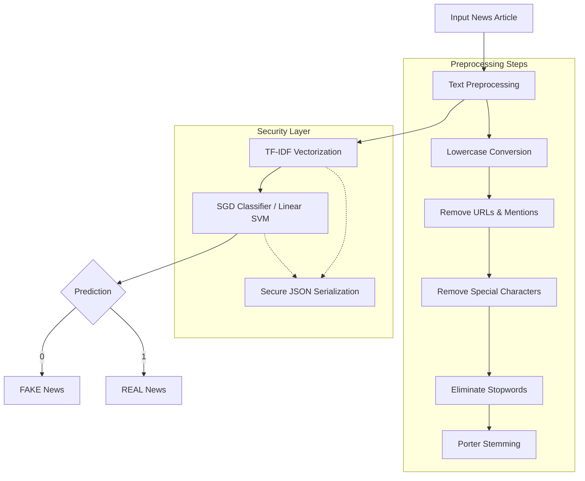

# 🔍 Fake News Detection System

An advanced machine learning application that uses Natural Language Processing (NLP) techniques to detect fake news articles. The system provides both a web interface and a desktop GUI for easy testing and deployment.

## ✨ Features

- **Advanced NLP Analysis**: Uses TF-IDF vectorization and SGD Classifier (Linear SVM)
- **Model Explainability**: Highlights the top contributing keywords and linguistic patterns that influence the "Fake" or "Real" verdict.
- **Interactive Dashboard**: Modern web interface with confidence visualization and real-time progress bars.
- **Fact-Checking Integration**: Direct links to **Google News** and **Snopes** for cross-referencing news headlines instantly.
- **Scan History**: Persistent tracking of your recent news analyses within the browser (using local storage) or within the GUI application.
- **Improved Confidence Scoring**: Uses a sigmoid-based probability mapping for more accurate certainty levels.
- **Secure Model Serialization**: Custom JSON-based serialization for the model and vectorizer to prevent security risks associated with legacy formats.
- **Dual Interface**: Fully functional **Flask-based Web App** and a **Tkinter-based Desktop GUI** with dashboard layouts.

## 🏗️ Model Architecture & Workflow



## 🚀 Quick Start

### Prerequisites

- Python 3.8+
- pip (Python package installer)

### Installation

1. Clone the repository:
```bash
git clone https://github.com/Ghulam-Mustafa-Keerio/Fake-News_Detection_System.git
cd Fake-News_Detection_System
```

2. Install required dependencies:
```bash
pip install -r requirements.txt
```

3. Train the model:
```bash
python train_model.py
```

This will generate `model.json` and `vectorizer.json` files using a **Secure Serialization Format**.

## 💻 Usage

### Web Application

1. Start the Flask server:
```bash
python app.py
```

2. Open your browser and navigate to `http://localhost:5000`

### Desktop GUI (Tkinter)

Run the standalone desktop application:
```bash
python gui.py
```

## 🧠 How It Works

### 1. Data Processing
The system handles large datasets including `fake.csv` and `true.csv`, though for demonstration purposes, `train_model.py` includes a sample data generator.

### 2. Text Preprocessing
- **Cleaning**: Removes noise such as HTML tags, URLs, and special characters.
- **Tokenization & Normalization**: Splits text into words and applies lowercase conversion.
- **Stemming**: Reduces words to their base form (e.g., "running" becomes "run").

### 3. Feature Extraction
- **TF-IDF (Term Frequency-Inverse Document Frequency)**: A statistical measure used to evaluate how important a word is to a document in a collection.
- **N-Grams**: Uses both unigrams and bigrams (1, 2) for better contextual understanding.

### 4. Classification Engine
- **SGD Classifier**: Implements a Linear SVM with hinge loss, optimized for sparse text data.
- **Explainability Layer**: The model now identifies and extracts the top 5 words that contributed most to a "Fake" or "Real" verdict.
- **Robust Confidence Scoring**: Implements a sigmoid-based probability mapping ($1 / (1 + e^{-k \cdot distance})$) for more realistic certainty levels.
- **Secure Storage**: Models are saved as human-readable JSON files, eliminating the `pickle` security vulnerabilities.

## 📊 Model Performance & Evaluation

The following results were obtained from the current model training session:

### 📊 Training Highlights
- **Model Accuracy**: **71.43%**
- **Samples**: 70 total (35 Fake, 35 Real)
- **Train/Test Split**: 80/20 ratio (14 samples for evaluation)

### 📋 Classification Report
| Class | Precision | Recall | F1-Score | Support |
| :--- | :--- | :--- | :--- | :--- |
| **Fake** | 0.88 | 0.70 | 0.78 | 10 |
| **Real** | 0.50 | 0.75 | 0.60 | 4 |
| **Overall Accuracy** | | | **0.71** | **14** |

### 🔍 Live Predictions Analysis
| News Text Sample | Prediction | Confidence | Contributing Keywords |
| :--- | :--- | :--- | :--- |
| "Scientists make breakthrough in cancer research at local university" | **REAL** | 93.63% | local, scientists, research |
| "Aliens control the government and hide among us confirmed" | **FAKE** | 98.46% | control, government |
| "Local community celebrates new park opening with festival" | **REAL** | 99.96% | local, new, community |

## �📁 Project Structure

```
Fake-News_Detection_System/
├── train_model.py          # Model training & secure serialization
├── app.py                  # Flask web server
├── gui.py                  # Tkinter UI application
├── requirements.txt        # Package dependencies
├── fake.csv & true.csv     # Training datasets
├── templates/             # HTML for web interface
├── model.json             # Securely saved model weights
└── vectorizer.json        # Securely saved TF-IDF vocabulary 
```

## 🛠️ Technologies Used

- **Python**: Core programming language
- **Flask**: Web framework for REST API
- **Scikit-learn**: Machine learning library
- **NLTK**: Natural language processing toolkit
- **Pandas & NumPy**: Data manipulation
- **Tkinter**: Desktop GUI framework
- **JSON**: Secure model serialization (replaced Pickle/Joblib)

## 📊 Sample Usage

### Python API Example

```python
from train_model import FakeNewsDetector

# Initialize detector
detector = FakeNewsDetector()
detector.load_model()

# Make prediction
text = "Your news article text here..."
prediction, confidence, keywords = detector.predict(text)

label = "REAL" if prediction == 1 else "FAKE"
print(f"Result: {label} (Confidence: {confidence:.2f}%)")

# View keyword impact
for kw in keywords:
    print(f"- {kw['word']}: {kw['impact']} (Impact Score: {kw['score']})")
```

## 🔐 Security Benefits

- This system is an assistive tool, not a definitive fact-checker
- Always verify important news from multiple reliable sources
- Model accuracy depends on training data quality and diversity
- The system works best with English language news articles

## 🤝 Contributing

Contributions are welcome! Please feel free to submit issues and pull requests.

## 📄 License

This project is licensed under the MIT License - see the [LICENSE](LICENSE) file for details.

## 🙏 Acknowledgments

- Built with open-source machine learning libraries
- Inspired by the need to combat misinformation
- Thanks to the NLP and ML communities for their tools and resources

## 📧 Contact

For questions or suggestions, please open an issue on GitHub.

---

**Note**: This is an educational project demonstrating NLP and machine learning applications. For production use, consider using larger, more diverse training datasets and additional validation mechanisms.
